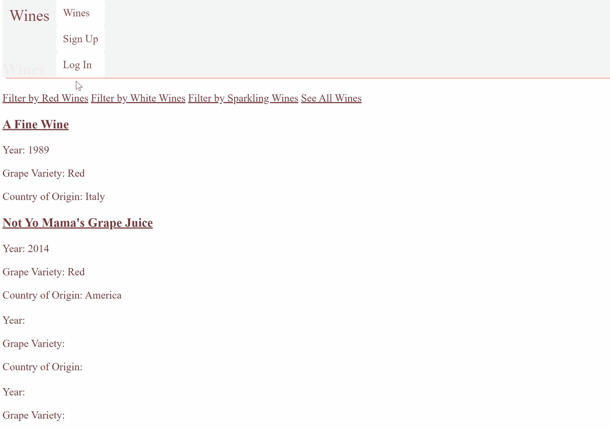

# Wine Cellar 

Wine Cellar is a wine database where users can create an account, and rate and review the wines they have tried. Welcome!

## Features
* User Login/Signup with authenticated password
* Third-Party authentication options for signup/login usint GitHub
* Users can add wine reviews and rate wines
* Users can view all of the wines they have reviews

## Tech Used
* Ruby [2.6.1]
* Rails [6.02] - MVC Web Framework
* Bycrypt [3.1.7] - gem for authentication and authorization
* Sqlite3 - database
* Omniauth-github - gem for omniauth with GitHub

## To Install

1. Clone this repo and run rails server 
2. In your browser go to 'http://localhost:3000/wines'
   - This is the main page of the website. Here all wines in the database are listed (more to come). A user who has not yet created an account can browse the wines, but do not have access to any wine reviews. 
3. Create an account! Either create a unique name on the signup page, or go click the "Log In" button on the nav bar to signup with the 3rd part, GitHub.

* Ruby version

* System dependencies

* Configuration

* Database creation

* Database initialization

* How to run the test suite

* Services (job queues, cache servers, search engines, etc.)

* Deployment instructions

* ...
